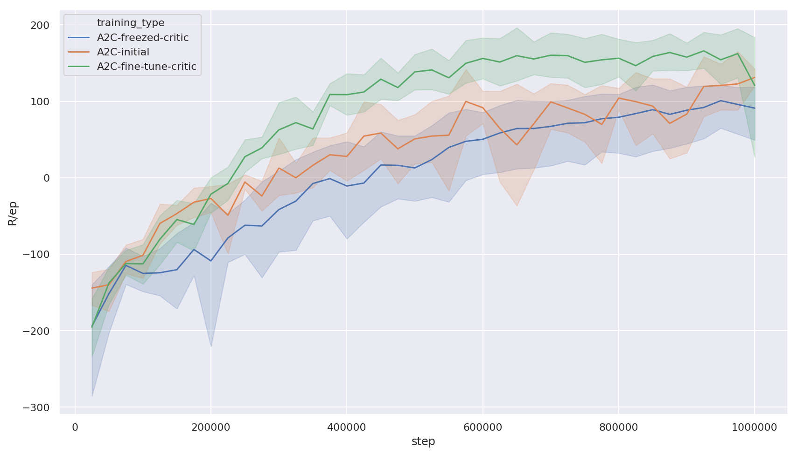
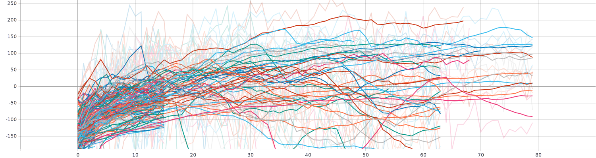
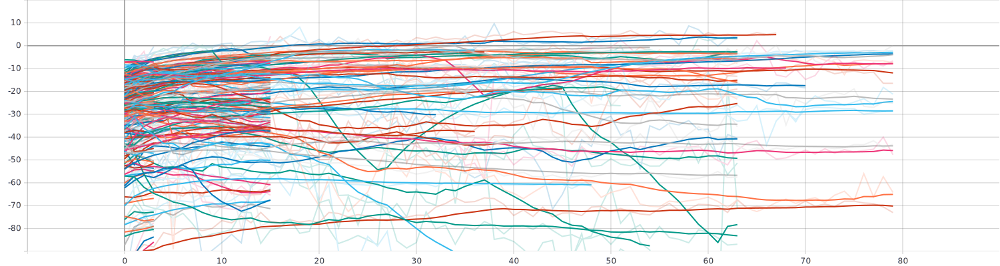
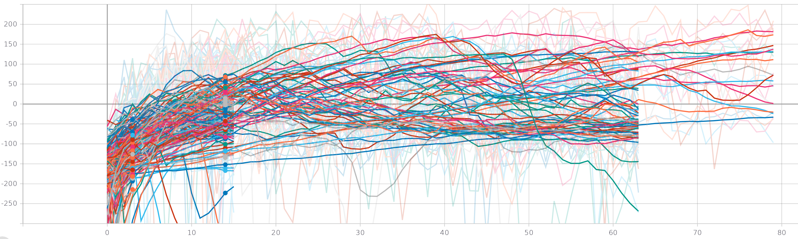
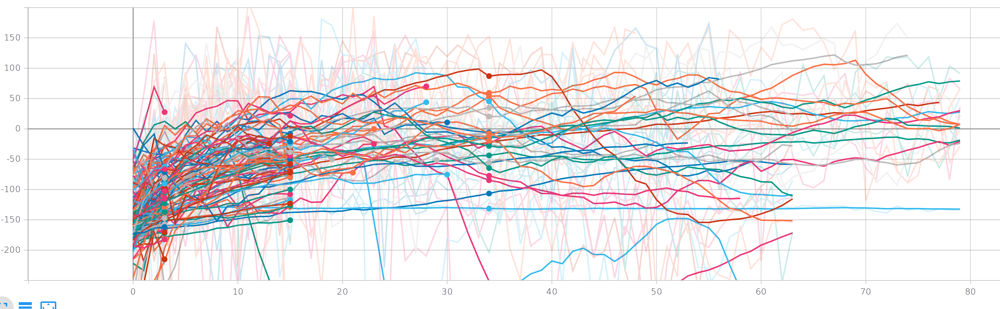
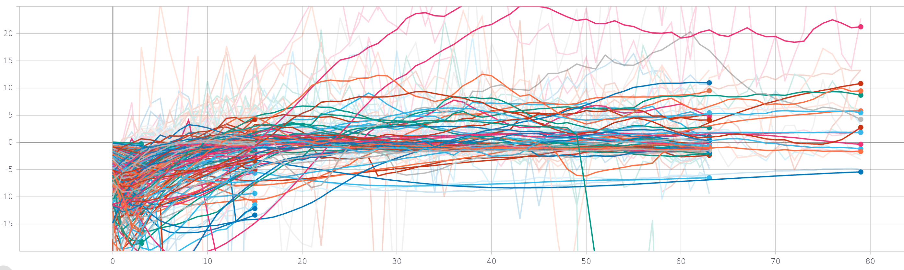
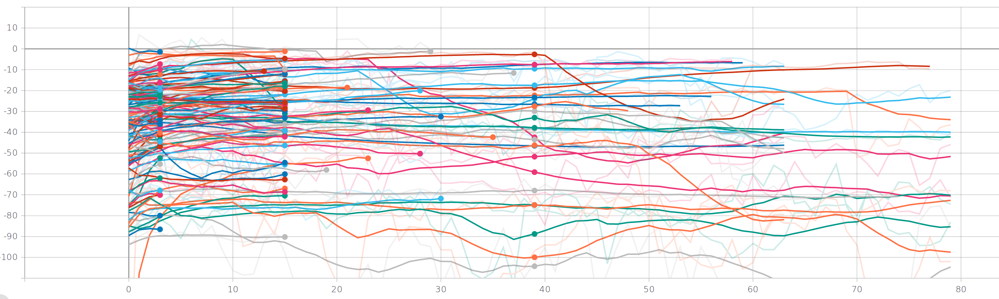
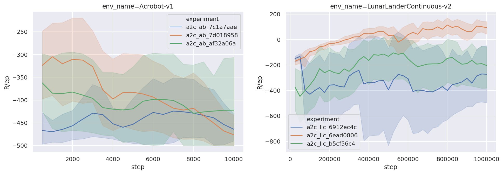
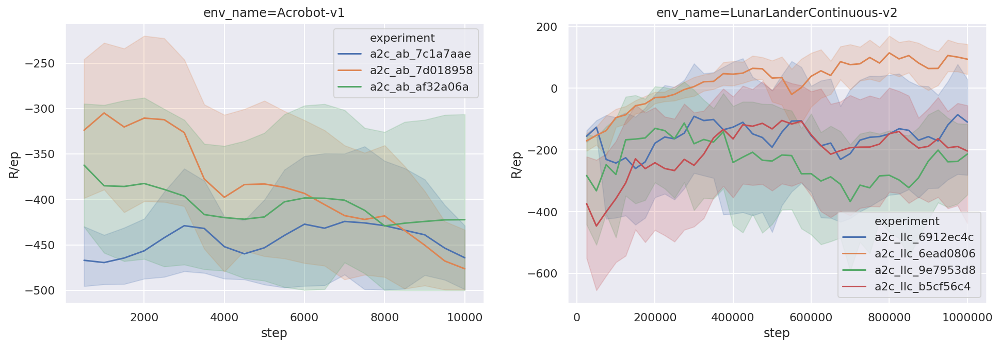

# Project log


# Dec 9. New results
---

**I completed most of the empty TODOs from above:**

- [x] Added histograms to `rlog`, didn't properly interpret them yet.
- [x] Completed the robustness checks for both the baseline and **neAC**


The curves below are averages of 10 different seeds for the best two
configurations found by `ray.tune`. You can see **neAC** is still lagging
behind on this environment (Lunar Lander with discrete actions). 

- [x] Implemented comparison with an optimum critic

So I trained five different seeds on the best configuration I have (orange
curve). I picked a checkpoint that learned the environment and re-initialized
its policy layer. Then I retrained it with "perfect" value function $V(s)$
and feature extraction $\phi(s)$ by either freezing $V(s)$ and $\phi(s)$
(blue line) or by fine-tuing them (green line).

:warning: I think the take-away message here is that there is little room for
improvement, at least on this environment.



## Next steps:

- Repeat these experiments on a more difficul environment, for example
_Bipedal Walker_ with continuous actions.
- Find a way to make sure $V(s)$ is actually optimum.


## Dec 5. Regroup
---

- [ ] Configure robustness check for A2C too.
- [ ] Implement and compare with _optimum_ critic.
- [ ] Add histograms to `rlog` ?
- The robustness check is running on `neAC` and is not looking exactly bad.

:warning: Need to gain more insight into the way the value function should behave.


## Dec 2. Check robustness of the new found configs
---

- [ ] Run the best configs on multiple seeds.
- [ ] Implement and compare with _optimum_ critic.
- [ ] Find a way to look into the value under-estimation problem of the DND.


## Nov 30, fewer neighbours pays off
---

For the first time neAC consistently achieves ~200 points. There's still
quite some variance left and it doesn't look more sample efficient than the
baseline at this point.



The value estimates though are still quite low.



## Nov 29, implement learning rate anealing
---

- also added support for anealing the critic's tabular learning rate (`dnd.lr`)

With these two improvements I ran `ray.tune` once again on the
**LunarLander-v2** (discrete actions) env. I find this to be one of the
easiest envs in the suite. Unfourtunately things are not looking any better
for neAC. Although hard to discern details, I'm puting some of the results
just to get some idea of the general trend.

- 256 trials for A2C
- 173 trials for neAC.
- game is considered solved at 200.
- each point is the mean return on 100 episodes.

These are heavily smoothed curves. Some of the experiments finish faster
because they are killed by the hyperparameter search algo.

### Mean Episodic Return

#### A2C
A2C solve the env fairly fast.


#### neAC
neAC shows quite a bit of promise in the first 15 evaluations (375,000
steps). However it only reaches ~150 points consistently, and only in the
first part of the training run.



### Mean Value Estimates

#### A2C
The value estimates seem all over the place.


#### neAC
By contrast neAC's value estimate are much more controlled.

:warning: However they don't go over 0, I need to figure out why is this happening.


### To do:

- Take the top configurations found here and run on 10 seeds, see if they are robust.
- **Investigate neAC's V(s) estimate, something's strange there.**
- Start logging the critic loss.
- Plot a histogram of gradients?
- Train with an optimum critic from the begining, see what happens.

#### Late updates

After discussing about the issue above with
[@tudor-berariu](https://github.com/tudor-berariu) I decided to include the
number of K-Nearest-Neighbours in the config search. Tudor's intuition is
that KNN can't extrapolate outside it's state space so I wanted to see if
smaller K could drive the values up. Also need to look at the weghts.


## Nov 28, implement good inits
---

- [#c9c5c34](https://github.com/floringogianu/neac/commit/c9c5c34f6968cdc7270b78c0c8e1f43c41452601)
adds support for good initializations to start the tuning process from. For
example the `search.yaml` file can now look like:
```yaml
hyperopt:
  lr: ["uniform", [0.0001, 0.005]]
  nsteps: ["choice", [20, 30, 40, 50, 60]]
  gamma: ["uniform", [0.91, 0.99]]
  beta_entropy: ["uniform", [0.001, 0.1]]

  dnd:
    size: ["choice", [1000, 3000, 5000, 10000, 20000, 30000]]
    lr: ["uniform", [0.01, 0.7]] 
    key_size: ["choice", [24, 32, 64]]
    use_critic_grads: ["choice", [True, False]]

good_inits:
  - lr: 0.0007
    gamma: 0.99
    nsteps: 3
    beta_entropy: 0.001
    dnd:
      size: 3
      lr: 0.2
      key_size: 1
      use_critic_grads: 0

  - lr: 0.001
    gamma: 0.99
    nsteps: 3
    beta_entropy: 0.001
    dnd:
      size: 3
      lr: 0.2
      key_size: 1
      use_critic_grads: 1
```


## Nov 27, confirm neAC too 
---

- [x] Configure and launch **neAC** experiments too.
- [x] Explore and extend last night's **A2C** experiments.
- [ ] Rerun `ray.tune` on Acrobot.
- [ ] Decide on what's next.

Initial results look bad on Acrobot, these hyperparameters are not robust
troughout the training. I am adding two more configs which appear to be
more stable.

| Env           |      A2C               |         neAC           |
|---------------|:----------------------:|:----------------------:|
| LunarLander-C | `b5`, `6e`, `6912ec4c` | `4dc127e8`, `97306f06` |
| Acrobot       | `af`, `7d`, `7c1a7aae` | `aa315a12`, `1a3ed1d8` |

**At this point I think I should run `ray.tune` again on Acrobot-v1**. The
models don't seem trained or robust.

Results with the two additional configs are dubious:



These two additional configs, `6912ec4c`, `7c1a7aae` have been chosen for
their stability. However they are not showing it.

I am adding some more:

| Env           |      A2C                  |         neAC           |
|---------------|:-------------------------:|:----------------------:|
| LunarLander-C | `b5`,`6e`,`69`,`9e7953d8` | `4dc127e8`, `97306f06` |


It's becoming clear that `ray.tune` is simply selecting some lucky seeds. All
four configurations below should have solved `LunarLander`.



### Summary

- Check the issue of low performance configurations found by `ray.tune` on the
discrete case too.
- Implement and look what happens with an optimal Value function.
- Look at gradients.


## Nov 26, robustness check
---

Select the best looking hyperparameters found by `ray.tune` for each
environment and train on ten seeds.


| Env           |      A2C               |         neAC           |
|---------------|:----------------------:|:----------------------:|
| LunarLander-C | `b5cf56c4`, `6ead0806` | `4dc127e8`, `97306f06` |
| LunarLander-D |                        |                        |
| Acrobot       | `af32a06a`, `7d018958` | `aa315a12`, `1a3ed1d8` |
| BipedalWlaker |                        |                        |

Tune results folders:

```bash
2019Nov23-111409_tune_a2c_dev       <-- acrobot
2019Nov23-113341_tune_neac_dev      <-- acrobot
2019Nov23-195637_tune_a2c_walker
2019Nov23-195911_tune_neac_walker
2019Nov24-191525_tune_neac_lld
2019Nov24-192502_tune_neac_walker
2019Nov25-124623_tune_neac_llc      <-- lunar-lander-c
2019Nov26-114401_tune_a2c_llc       <-- lunar-lander-c
```

I only managed to start `a2c_confirm` with the four experiments above.